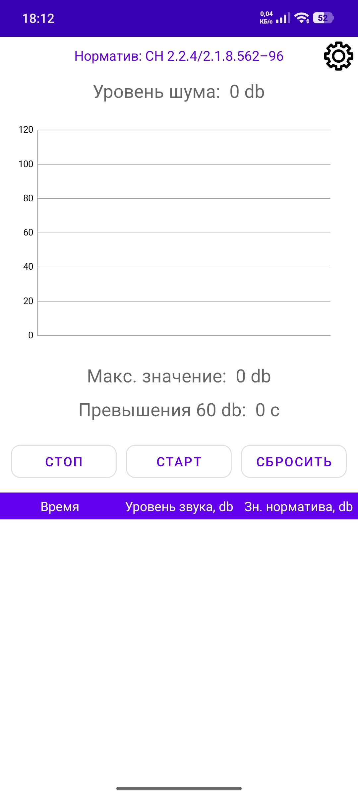
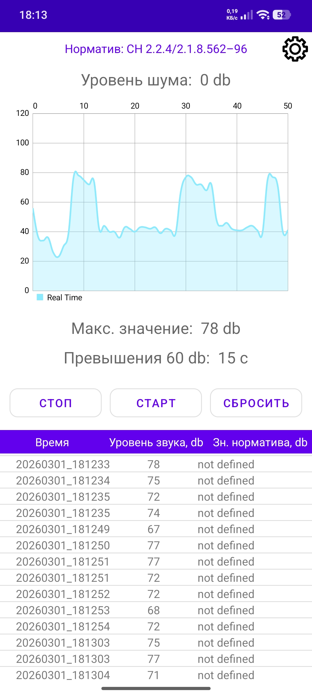
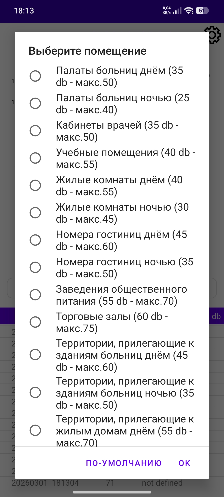

# NoiseReactor

Мобильное приложение для мониторинга и контроля уровня шума.

## Описание

NoiseReactor — Android-приложение, предназначенное для измерения уровня шума в помещении или на улице в реальном времени. Приложение позволяет контролировать допустимые значения шума и анализировать изменения уровня звука.

Подходит для использования:
- в офисах;
- учебных заведениях;
- студиях;
- домашних условиях.

## Основные возможности

- Отслеживание уровня шума в реальном времени;
- Уведомление при превышении допустимого порога;
- Логирование данных для последующего анализа;
- Настройка допустимого уровня шума;
- Визуализация изменений уровня звука.

## Технологии

- **Java** — язык программирования. 
- **Android SDK** - платформа.
- **MediaRecorder, AudioRecord, AudioFormat** — работа с аудио.
- **LineChart, ILineDataSet, LineData, LineDataSet** — визуализация данных.
- **BaseAdapter, TextView и т.д.** — UI-компоненты.

## Скриншоты

